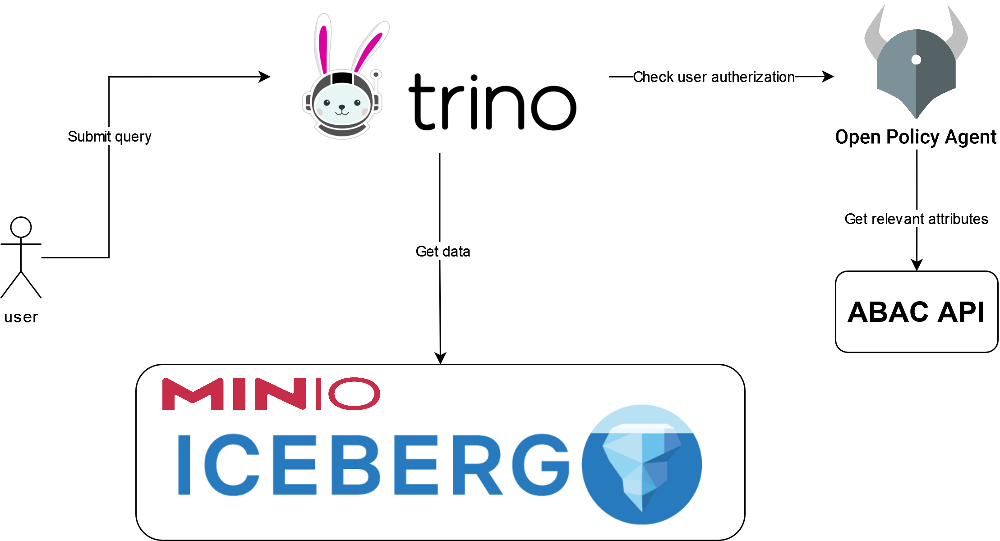

# ABAC Authorization with Trino and OPA using External API

## Overview

This project demonstrates how to implement Attribute-Based Access Control (ABAC) authorization in Trino (formerly known as PrestoSQL) using Open Policy Agent (OPA). The unique aspect of this implementation is that user attributes and schema/table/column information are dynamically fetched from an external API.

## Requirements

- Docker (For containerized deployment)

## Docker Deployment:

Use the provided Docker Compose file (docker-compose.yml) for a containerized deployment. Update the environment variables in the file according to your configuration.
- `docker compose up --build --detach`

## Usage

### Publish policy
For publishing access_policy_user.rego we will run
- `cd opa/policies`
- `curl -X PUT --data-binary @access_policy_user.rego http://localhost:8182/v1/policies/main`

For check if the policy was succeffuly published run:
- `curl http://localhost:8181/v1/policies`

## Project services

### Services overview
- trino: A Trino (formerly PrestoSQL) service for distributed SQL query processing.
- opa: Open Policy Agent for policy-based access control.
- abac_api: An API service for Attribute-Based Access Control (ABAC).
- attribute_db: MongoDB service for storing attributes of users and resources (catalogs, schemas, tables and columns).
- rest: Iceberg REST service for interacting with a data lake, with dependencies on Postgres and Minio.
- postgres: PostgreSQL database service for storing metadata for the datalake catalog.
- minio: Minio, an object storage server compatible with Amazon S3.
- mc: Minio Client for managing Minio server.

### Services and Ports

- trino: http://localhost:8080
- opa: http://localhost:8181
- abac_api: http://localhost:8081
- attribute_db: MongoDB on port 27017
- rest: Iceberg REST service on http://localhost:8183
- postgres: PostgreSQL on port 5432
- minio: Minio on http://localhost:9000 (console on http://localhost:9001)
- mc: Minio Client (configured for Minio server)

